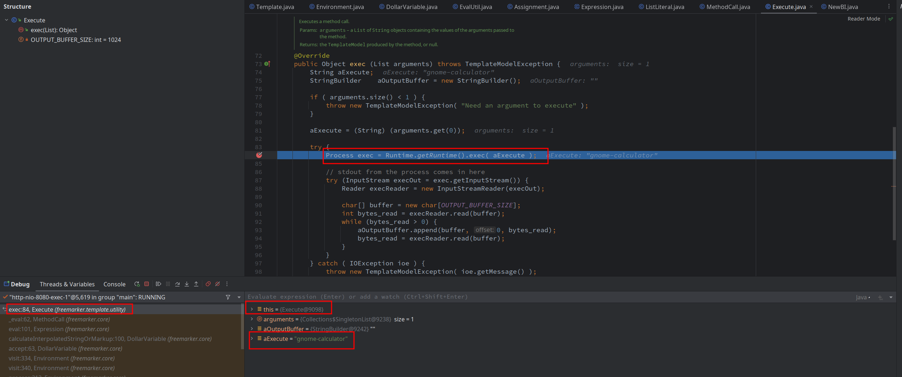

# SSTI (Server-Side Template Injection)

## freemarker

### stack

```
exec:347, Runtime (java.lang)
exec:84, Execute (freemarker.template.utility)
_eval:62, MethodCall (freemarker.core)
eval:101, Expression (freemarker.core)
calculateInterpolatedStringOrMarkup:100, DollarVariable (freemarker.core)
accept:63, DollarVariable (freemarker.core)
visit:334, Environment (freemarker.core)
visit:340, Environment (freemarker.core)
process:313, Environment (freemarker.core)
process:383, Template (freemarker.template)
A1:79, SSTIController (com.example.jgvwa.controller)
```

### A1:79, SSTIController (com.example.jgvwa.controller)


### process:383, Template (freemarker.template)

```java
public void process(Object dataModel, Writer out)
throws TemplateException, IOException {
    createProcessingEnvironment(dataModel, out, null).process();
}
```


### process:313, Environment (freemarker.core)

```java
public void process() throws TemplateException, IOException {}
```


### visit:340, Environment (freemarker.core)

```java
void visit(TemplateElement element) throws IOException, TemplateException {
    // ATTENTION: This method body is manually "inlined" into visit(TemplateElement[]); keep them in sync!
    pushElement(element);
    try {
        TemplateElement[] templateElementsToVisit = element.accept(this);
        if (templateElementsToVisit != null) {
            for (TemplateElement el : templateElementsToVisit) {
                if (el == null) {
                    break;  // Skip unused trailing buffer capacity 
                }
                visit(el);
            }
        }
    } catch (TemplateException te) {
        handleTemplateException(te);
    } finally {
        popElement();
    }
    // ATTENTION: This method body above is manually "inlined" into visit(TemplateElement[]); keep them in sync!
}
```


### visit:334, Environment (freemarker.core)


### accept:63, DollarVariable (freemarker.core)

```java
TemplateElement[] accept(Environment env) throws TemplateException, IOException {}
```


### calculateInterpolatedStringOrMarkup:100, DollarVariable (freemarker.core)

```java
protected Object calculateInterpolatedStringOrMarkup(Environment env) throws TemplateException {
    return EvalUtil.coerceModelToStringOrMarkup(escapedExpression.eval(env), escapedExpression, null, env);
}
```


### eval:101, Expression (freemarker.core)


### _eval:62, MethodCall (freemarker.core)


### exec:84, Execute (freemarker.template.utility)



### exec:347, Runtime (java.lang)


