# SSTI (Server-Side Template Injection)

## velocity

### stack

```
invoke:473, Method (java.lang.reflect)
doInvoke:395, UberspectImpl$VelMethodImpl (org.apache.velocity.util.introspection)
invoke:384, UberspectImpl$VelMethodImpl (org.apache.velocity.util.introspection)
execute:173, ASTMethod (org.apache.velocity.runtime.parser.node)
execute:280, ASTReference (org.apache.velocity.runtime.parser.node)
render:369, ASTReference (org.apache.velocity.runtime.parser.node)
render:342, SimpleNode (org.apache.velocity.runtime.parser.node)
render:1378, RuntimeInstance (org.apache.velocity.runtime)
evaluate:1314, RuntimeInstance (org.apache.velocity.runtime)
evaluate:1265, RuntimeInstance (org.apache.velocity.runtime)
evaluate:180, Velocity (org.apache.velocity.app)
A2:96, SSTIController (com.example.jgvwa.controller)
```

### A2:96, SSTIController (com.example.jgvwa.controller)

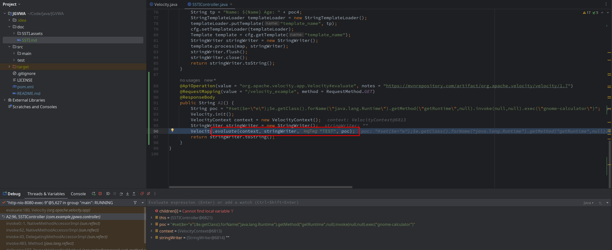

### evaluate:180, Velocity (org.apache.velocity.app)

```java
public static boolean evaluate( Context context,  Writer out, String logTag, String instring )
    throws ParseErrorException, MethodInvocationException, ResourceNotFoundException{}
```

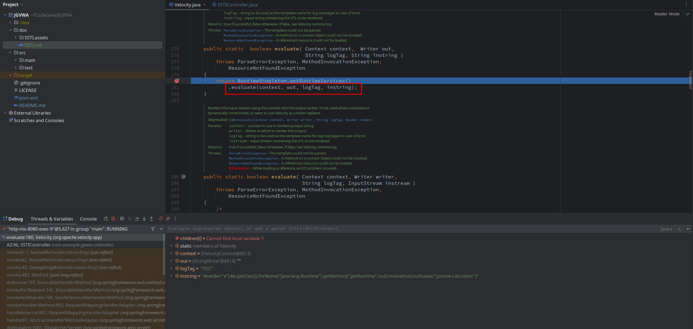

### evaluate:1265, RuntimeInstance (org.apache.velocity.runtime)

```java
public boolean evaluate(Context context,  Writer out, String logTag, String instring){}
```

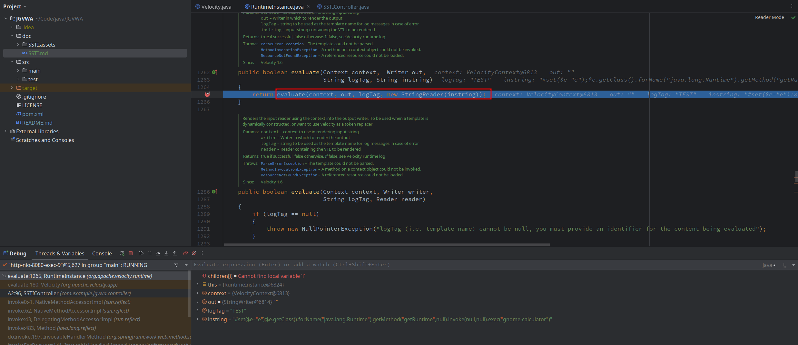

### evaluate:1314, RuntimeInstance (org.apache.velocity.runtime)

```java
public boolean evaluate(Context context, Writer writer, String logTag, Reader reader){}
```

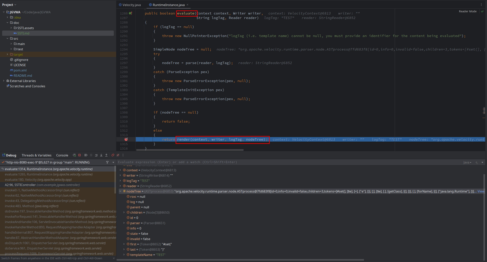

### render:1378, RuntimeInstance (org.apache.velocity.runtime)

```java
public boolean render(Context context, Writer writer, String logTag, SimpleNode nodeTree){}
```

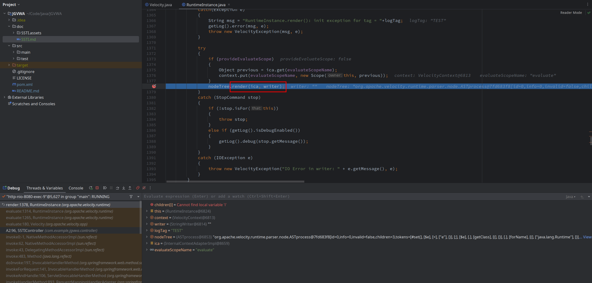

### render:342, SimpleNode (org.apache.velocity.runtime.parser.node)

```java
public boolean render( InternalContextAdapter context, Writer writer)
    throws IOException, MethodInvocationException, ParseErrorException, ResourceNotFoundException{}
```

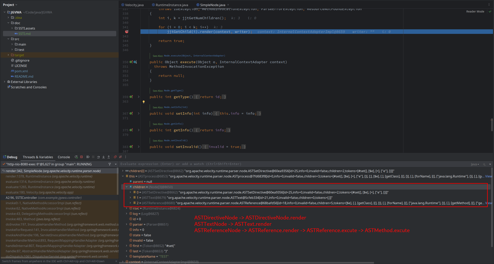

### render:369, ASTReference (org.apache.velocity.runtime.parser.node)

```java
public boolean render(InternalContextAdapter context, Writer writer) throws IOException, MethodInvocationException{}
```

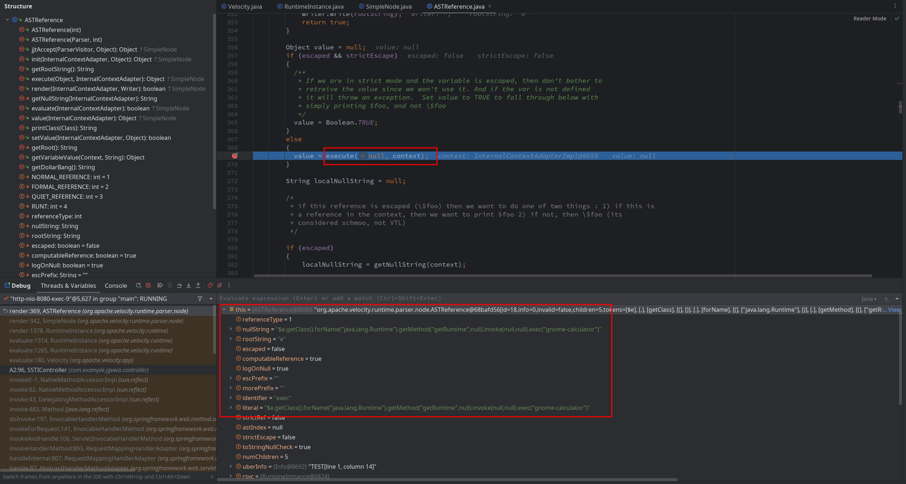

### execute:280, ASTReference (org.apache.velocity.runtime.parser.node)

```java
public Object execute(Object o, InternalContextAdapter context) throws MethodInvocationException{}
```

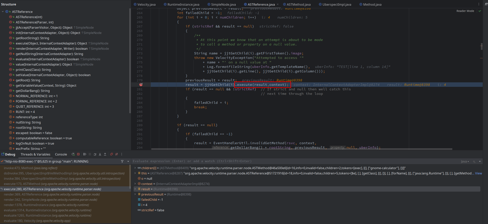

### execute:173, ASTMethod (org.apache.velocity.runtime.parser.node)

```java
public Object execute(Object o, InternalContextAdapter context) throws MethodInvocationException{}
```

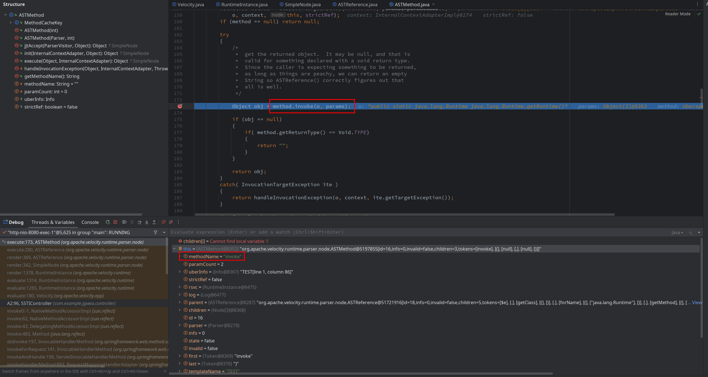

### invoke:384, UberspectImpl$VelMethodImpl (org.apache.velocity.util.introspection)

```java
public Object invoke(Object o, Object[] actual) throws Exception{}
```

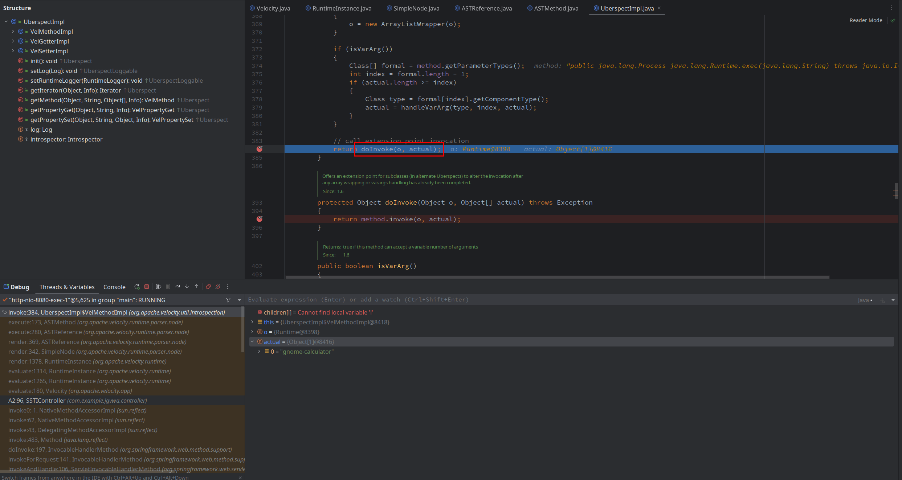

### doInvoke:395, UberspectImpl$VelMethodImpl (org.apache.velocity.util.introspection)

```java
protected Object doInvoke(Object o, Object[] actual) throws Exception {return method.invoke(o, actual);}
```

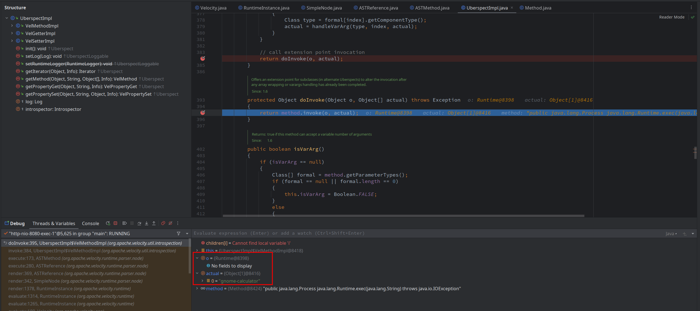

### invoke:473, Method (java.lang.reflect)

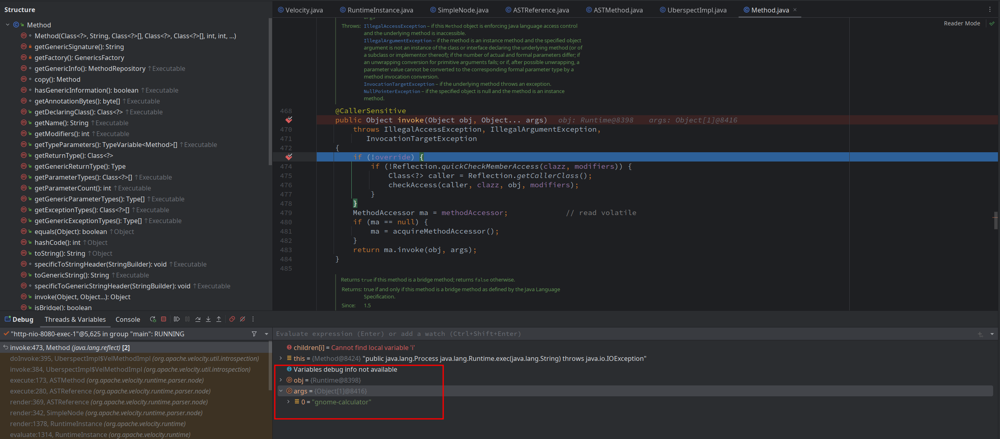